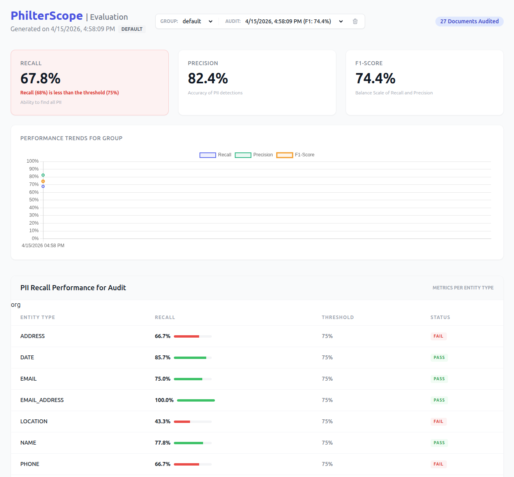

# PhilterScope

PhilterScope is a standalone CLI tool for PII redaction auditing and policy optimization. It allows you to audit the performance of [Philter](https://www.github.com/philterd/philter) by comparing its redaction results against a "golden dataset" of labeled PII.

PhilterScope is a core part of our framework for implementing PII/PHI redaction solutions. To learn more, visit us at [Philterd](https://www.philterd.ai). Professional services are available for custom PII redaction solutions.



## Documentation

- [Running PhilterScope](docs/running.md): Detailed explanation of commands and flags.
- [Policy Recommendations](docs/docs/recommendations.md): What a recommendation contains and how to consume it.
- [Environment Variables](docs/environment-variables.md): Available environment variables for configuration.
- [Development](docs/development.md): Instructions for building and testing the project.

## Quick Start

The following command will compare the raw text in the `examples/raw` directory against the golden dataset in `examples/golden` and generate an HTML report in the `examples/` directory.

```
./philterscope-audit --golden ./examples/golden/ --input ./examples/raw/ --output ./examples/ --threshold 0.75
```

To store the audit in MongoDB database, provide the database connection information:

```
PHILTERSCOPE_MONGODB_CONNECTION_STRING=mongodb://localhost:27017/philterscope ./philterscope-audit --golden ./examples/golden/ --input ./examples/raw/ --output ./examples/ --threshold 0.75
```

The following command will launch the evaluation UI on port 5000 and load the report generated in the previous step.

```
./philterscope-serve --report ./examples/report.json --port 5000
```

Likewise with audits, to view audit results stored in MongoDB database, provide the database connection information:

```
PHILTERSCOPE_MONGODB_CONNECTION_STRING=mongodb://localhost:27017/philterscope ./philterscope-serve --report ./examples/report.json --port 5000
```

See the [documentation](docs/running.md) for more details and options.

## Docker

The image carries both binaries. `philterscope-serve` is the default command and the working directory is `/data`.

The image is published on [Docker Hub](https://hub.docker.com/r/philterd/philter-scope):

```
docker pull philterd/philter-scope:latest
```

`latest` tracks the most recent release. Pin a version for anything you deploy, so an upgrade is a change you make rather than one you receive:

```
docker pull philterd/philter-scope:0.1.0
```

Images are published for `linux/amd64` and `linux/arm64`.

Serve a report generated by a previous audit:

```
docker run --rm -p 5000:5000 \
  -v "$PWD/examples/report.json:/data/report.json:ro" \
  philterd/philter-scope:latest
```

Serve from MongoDB instead, which takes precedence over the report file:

```
docker run --rm -p 5000:5000 \
  -e PHILTERSCOPE_MONGODB_CONNECTION_STRING=mongodb://mongo:27017/philterscope \
  philterd/philter-scope:latest
```

Run an audit by overriding the command. The container runs as a non-root user, so `--user` is needed for it to write the reports back to a bind-mounted directory:

```
docker run --rm --user "$(id -u):$(id -g)" \
  -v "$PWD/examples:/data" \
  philterd/philter-scope:latest \
  philterscope-audit --golden /data/golden/ --input /data/raw/ --output /data/ --threshold 0.75
```

### Docker Compose

[`docker-compose.yaml`](docker-compose.yaml) runs both steps in order. The audit runs once and writes its reports into `./data`, then the dashboard starts and serves them on port 5000:

```
mkdir -p data/golden data/raw

export PHILTER_URL=http://philter.internal:8080
docker compose up
```

`PHILTER_TOKEN`, the image tag, the recall threshold, and the uid and gid the audit writes as are all environment variables the file reads, documented at the top of it and in the [running guide](https://philterd.github.io/philter-scope/running/).

The server answers health checks at `/api/health`:

```
curl http://localhost:5000/api/health
```

It reports the released version:

```json
{"status": "UP", "applicationVersion": "0.1.0"}
```

To build the image yourself instead of pulling it, see the [development guide](docs/docs/development.md).

## License

Copyright 2026 Philterd, LLC. "Philter" is a registered trademark of Philterd, LLC. All rights reserved.

Licensed under the Apache License, Version 2.0.